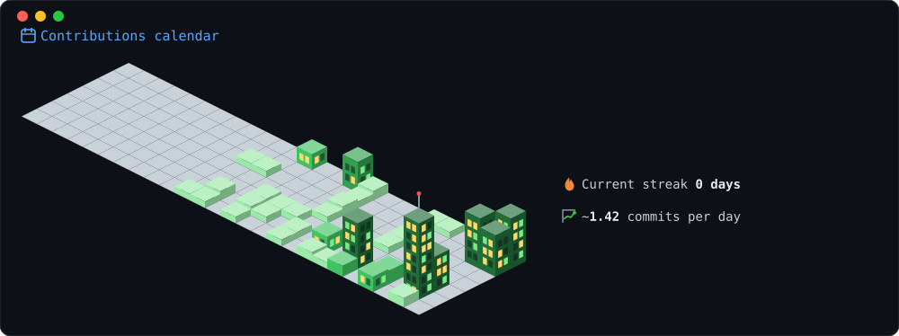

<!-- 
  GitHub Profile README - Neofetch Style
  Repository: brenandapamudya1/brenandapamudya1
  
  How to update:
  1. Edit the generate_svg.py script to change your info
  2. Run: python3 generate_svg.py
  3. Commit and push
  
  The GitHub Actions workflow auto-updates stats daily.
-->

  
  

  

  

   
  🎧 Track: デイドリーム (Daydream) — RINZO, MAHIRU · Music by NoCopyrightSounds

  <h3>Tech Stack</h3>

  

    <strong>Languages</strong> 
    
    
    
  

  

    <strong>Robotics &amp; Vision</strong> 
    
    
    
  

  

    <strong>Data Science</strong> 
    
    
    
    
    
    
  

  

    <strong>Database Management</strong> 
    
    
    
    
    
  

  

    <strong>Web Development</strong> 
    
    
    
    
  

  

    <strong>Tools &amp; Platform</strong> 
    
    
  

<!-- GitHub Stats Cards (optional, hidden below the neofetch) -->
<!--

  

-->
