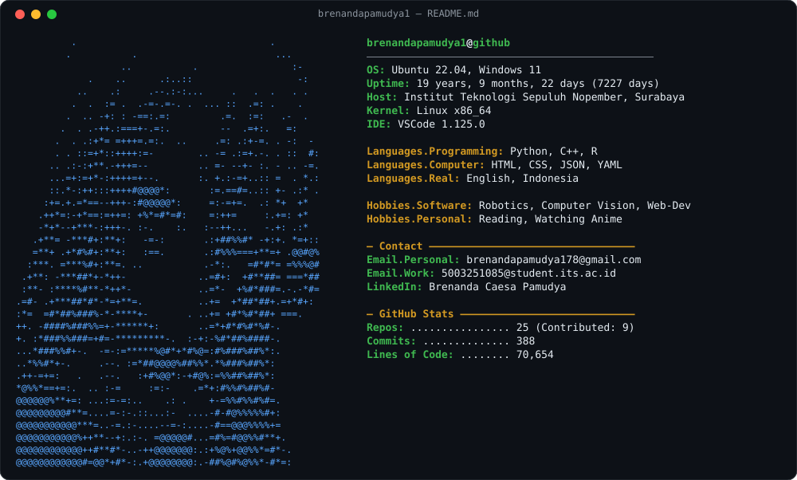
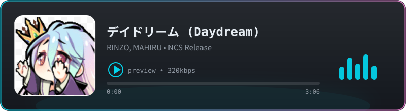

<!-- 
  GitHub Profile README - Neofetch Style
  Repository: brenandapamudya1/brenandapamudya1
  
  How to update:
  1. Edit the generate_svg.py script to change your info
  2. Run: python3 generate_svg.py
  3. Commit and push
  
  The GitHub Actions workflow auto-updates stats daily.
-->

  
  

  

   
  🎧 Track: デイドリーム (Daydream) — RINZO, MAHIRU · Music by NoCopyrightSounds · klik kartu untuk play

<!-- GitHub Stats Cards (optional, hidden below the neofetch) -->
<!--

  

-->
